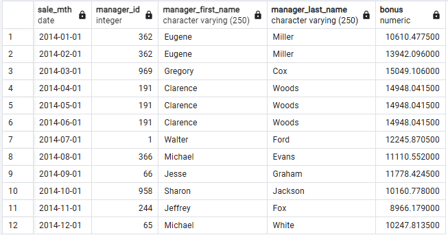

```sql
WITH mgrs AS (
	SELECT DISTINCT manager_id, manager_first_name, manager_last_name
	FROM v_fact_sale 
	WHERE sale_date BETWEEN TO_DATE('2013-10-01', 'YYYY-MM-DD') AND TO_DATE('2014-12-31', 'YYYY-MM-DD') AND manager_id IS NOT NULL
), mths AS (
	SELECT GENERATE_SERIES(TO_DATE('2013-10-01', 'YYYY-MM-DD'), TO_DATE('2014-12-31', 'YYYY-MM-DD'), '1 month')::DATE AS month
), mth_no_sales_by_mgr AS (
	SELECT manager_id, manager_first_name, manager_last_name, month
	FROM mgrs, mths
	EXCEPT
	SELECT DISTINCT manager_id, manager_first_name, manager_last_name, DATE_TRUNC('month', sale_date)::DATE
	FROM v_fact_sale 
), mth_sales_by_mgr AS (
	SELECT manager_id, manager_first_name, manager_last_name,
		DATE_TRUNC('month', sale_date)::DATE AS sale_mth,
		SUM(sale_amount) AS mth_sale_amount
	FROM v_fact_sale
	WHERE sale_date BETWEEN TO_DATE('2013-10-01', 'YYYY-MM-DD') AND TO_DATE('2014-12-31', 'YYYY-MM-DD')
	GROUP BY manager_id, manager_first_name, manager_last_name, sale_mth
	UNION ALL
	SELECT manager_id, manager_first_name, manager_last_name, month, 0
	FROM mth_no_sales_by_mgr
), prev_3_mths_sales_by_mgr AS (
	SELECT sale_mth, manager_id, manager_first_name, manager_last_name,
		COALESCE(SUM(mth_sale_amount) OVER (
		PARTITION BY manager_id ORDER BY sale_mth RANGE BETWEEN INTERVAL '3' MONTH PRECEDING AND INTERVAL '1' SECOND PRECEDING
		), 0) AS prev_3_mths_sale_amount
	FROM mth_sales_by_mgr
), mgrs_rating_by_mth AS (
	SELECT sale_mth, manager_id, manager_first_name, manager_last_name, prev_3_mths_sale_amount,
	RANK() OVER (PARTITION BY sale_mth ORDER BY prev_3_mths_sale_amount DESC) AS rating
	FROM prev_3_mths_sales_by_mgr
)
SELECT sale_mth, manager_id, manager_first_name, manager_last_name, prev_3_mths_sale_amount * 0.05 AS bonus
FROM mgrs_rating_by_mth
WHERE sale_mth BETWEEN TO_DATE('2014-01-01', 'YYYY-MM-DD') AND TO_DATE('2014-12-31', 'YYYY-MM-DD') AND rating = 1
```
