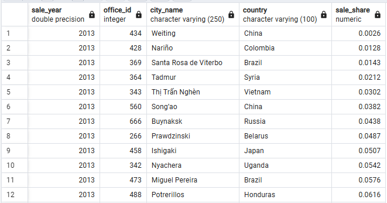

```sql
SELECT DATE_PART('year', sale_date) AS sale_year,
    office_id, city_name, country,
    ROUND(SUM(sale_amount) * 100 / SUM(SUM(sale_amount)) OVER (PARTITION BY DATE_PART('year', sale_date)), 4) AS sale_share
FROM v_fact_sale
WHERE sale_date BETWEEN TO_DATE('2013-01-01', 'YYYY-MM-DD') AND TO_DATE('2014-12-31', 'YYYY-MM-DD')
GROUP BY sale_year, office_id, city_name, country
ORDER BY sale_year, sale_share;
```
