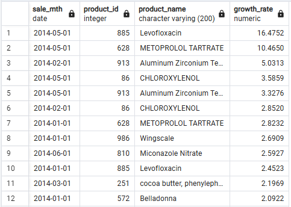

```sql
WITH mth_sales AS (
    SELECT product_id, product_name,
    	DATE_TRUNC('month', sale_date)::DATE AS sale_mth,
    	SUM(sale_amount) AS mth_sale_amount
    FROM v_fact_sale
    WHERE sale_date BETWEEN TO_DATE('2013-12-01', 'YYYY-MM-DD') AND TO_DATE('2014-06-30', 'YYYY-MM-DD')
    GROUP BY product_id, product_name, sale_mth
    ORDER BY product_id, sale_mth
)
SELECT sale_mth, product_id, product_name,
	ROUND(COALESCE(mth_sale_amount / LAG(mth_sale_amount) OVER (PARTITION BY product_id), 0), 4) AS growth_rate
FROM mth_sales
ORDER BY growth_rate DESC;
```
