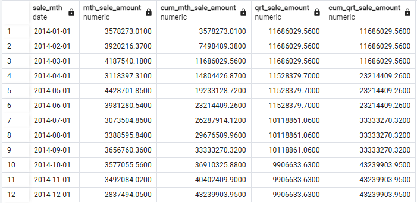

```sql
WITH mth_sales AS (
    SELECT DATE_TRUNC('month', sale_date)::DATE AS sale_mth, SUM(sale_amount) AS mth_sale_amount
    FROM v_fact_sale
    WHERE sale_date BETWEEN TO_DATE('2014-01-01', 'YYYY-MM-DD') AND TO_DATE('2014-12-31', 'YYYY-MM-DD')
    GROUP BY sale_mth
    ORDER BY sale_mth
)
SELECT sale_mth, mth_sale_amount,
	SUM(mth_sale_amount) OVER (ORDER BY sale_mth) AS cum_mth_sale_amount,
	SUM(mth_sale_amount) OVER (PARTITION BY DATE_TRUNC('quarter', sale_mth)) AS qrt_sale_amount,
	SUM(mth_sale_amount) OVER (ORDER BY DATE_TRUNC('quarter', sale_mth)) AS cum_qrt_sale_amount
FROM mth_sales
```
