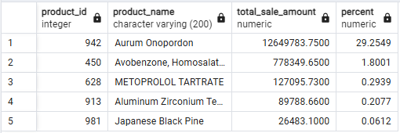

```sql
WITH avg_prod_price AS (
    SELECT product_id, AVG(sale_price) AS avg_price
    FROM v_fact_sale
    WHERE sale_date BETWEEN TO_DATE('2014-01-01', 'YYYY-MM-DD') AND TO_DATE('2014-12-31', 'YYYY-MM-DD')
    GROUP BY product_id, product_name
), prod_rating AS (
    SELECT product_id, NTILE(10) OVER (ORDER BY avg_price) AS rating
    FROM avg_prod_price
), total_profit AS (
    SELECT SUM(sale_amount) 
    FROM v_fact_sale
    WHERE sale_date BETWEEN TO_DATE('2014-01-01', 'YYYY-MM-DD') AND TO_DATE('2014-12-31', 'YYYY-MM-DD')
)
SELECT product_id, product_name,
	SUM(sale_amount) AS total_sale_amount,
	ROUND(SUM(sale_amount) * 100 / (SELECT * FROM total_profit), 4) AS percent
FROM v_fact_sale
WHERE sale_date BETWEEN TO_DATE('2014-01-01', 'YYYY-MM-DD') AND TO_DATE('2014-12-31', 'YYYY-MM-DD')
	AND product_id IN (SELECT product_id FROM prod_rating WHERE rating IN (1, 10))
GROUP BY product_id, product_name
ORDER BY percent DESC;
```
