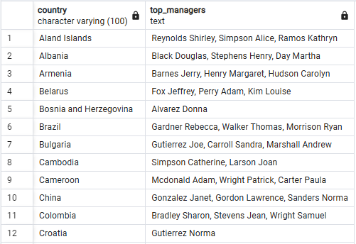

```sql
WITH sales_by_mgr AS (
    SELECT country, manager_id, manager_last_name, manager_first_name,
        SUM(sale_amount) AS sale_amount_by_mgr
    FROM v_fact_sale
    WHERE sale_date BETWEEN TO_DATE('2014-01-01', 'YYYY-MM-DD') AND TO_DATE('2014-12-31', 'YYYY-MM-DD') AND country IS NOT NULL
    GROUP BY country, manager_id, manager_last_name, manager_first_name
), 
mgr_rating_by_country AS (
    SELECT country, manager_id, manager_last_name, manager_first_name,
        DENSE_RANK() OVER (PARTITION BY country ORDER BY sale_amount_by_mgr DESC) AS rating
    FROM sales_by_mgr
)
SELECT country, STRING_AGG(manager_last_name||' '||manager_first_name, ', ') AS top_managers
FROM mgr_rating_by_country
WHERE rating <= 3
GROUP BY country
ORDER BY country;
```
