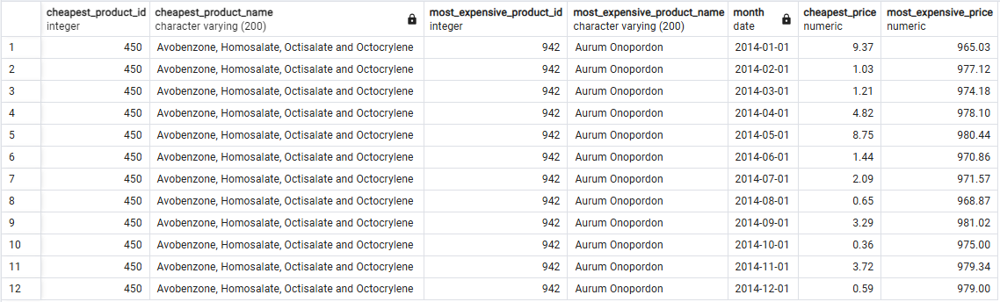

```sql
WITH max_and_min_price_by_mth AS (
    SELECT DATE_TRUNC('month', sale_date)::DATE AS sale_mth, MIN(sale_price) AS min_price, MAX(sale_price) AS max_price
    FROM v_fact_sale
    WHERE sale_date BETWEEN TO_DATE('2014-01-01', 'YYYY-MM-DD') AND TO_DATE('2014-12-31', 'YYYY-MM-DD')
    GROUP BY sale_mth
), cheapest_prod_by_mth AS (
    SELECT t2.sale_mth, t1.product_id, t1.product_name, t2.min_price
    FROM v_fact_sale t1
    JOIN max_and_min_price_by_mth t2 ON t1.sale_price = t2.min_price AND DATE_TRUNC('month', t1.sale_date) = t2.sale_mth
), most_expensive_prod_by_mth AS (
    SELECT t2.sale_mth, t1.product_id, t1.product_name, t2.max_price
    FROM v_fact_sale t1
    JOIN max_and_min_price_by_mth t2 ON t1.sale_price = t2.max_price AND DATE_TRUNC('month', t1.sale_date) = t2.sale_mth
)
SELECT t1.product_id AS cheapest_product_id,
	t1.product_name AS cheapest_product_name,
	t2.product_id AS most_expensive_product_id,
	t2.product_name AS most_expensive_product_name,
	t1.sale_mth AS month,
	t1.min_price AS cheapest_price,
	t2.max_price AS most_expensive_price
FROM cheapest_prod_by_mth t1
JOIN most_expensive_prod_by_mth t2 ON t1.sale_mth = t2.sale_mth
ORDER BY month;
```
