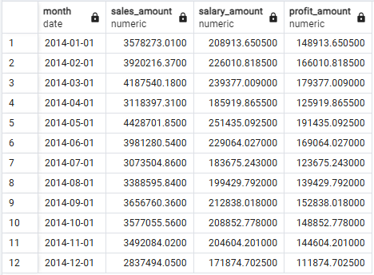

```sql
WITH mth_figures AS (
    SELECT DATE_TRUNC('month', sale_date)::DATE AS sale_mth,
        SUM(sale_amount) AS mth_revenue,
        SUM(sale_amount * 0.90) AS mth_costs,
        30000 + SUM(sale_amount * 0.05) AS mth_salary
    FROM v_fact_sale
    WHERE sale_date BETWEEN TO_DATE('2014-01-01', 'YYYY-MM-DD') AND TO_DATE('2014-12-31', 'YYYY-MM-DD')
    GROUP BY DATE_TRUNC('month', sale_date)
    ORDER BY sale_mth
)
SELECT sale_mth AS month,
    mth_revenue AS sales_amount,
    mth_salary AS salary_amount,
    mth_revenue - (mth_costs + mth_salary) AS profit_amount
FROM mth_figures;
```
