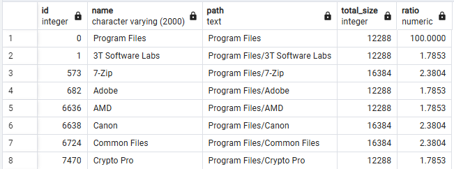

```sql
-- 1
WITH RECURSIVE t1 AS (
    SELECT id, parent_id, name, type, name::TEXT AS path
    FROM file_system
    WHERE parent_id IS NULL
    UNION ALL
    SELECT fs.id, fs.parent_id, fs.name, fs.type, t1.path||'/'||fs.name
    FROM file_system fs
    JOIN t1 ON fs.parent_id = t1.id
)
SELECT id, name, path
FROM t1
WHERE type = 'DIR';

-- Напишем вспомогательную функцию на PL/pgSQL
CREATE OR REPLACE FUNCTION calculate_dir_size(dir_id INT)
RETURNS BIGINT AS $$
DECLARE
    total_size BIGINT = 0;
    _dir_id INT;
BEGIN
    SELECT COALESCE(SUM(file_size), 0) INTO total_size
    FROM file_system
    WHERE parent_id = dir_id AND type = 'FILE';

    FOR _dir_id IN
        SELECT id
        FROM file_system
        WHERE parent_id = dir_id AND type = 'DIR'
    LOOP
        total_size = total_size + calculate_dir_size(_dir_id);
    END LOOP;

    RETURN total_size;
END;
$$ LANGUAGE plpgsql;

-- 2
WITH RECURSIVE t1 AS (
    SELECT id, parent_id, name, type, file_size, name::TEXT AS path
    FROM file_system
    WHERE parent_id IS NULL
    UNION ALL
    SELECT fs.id, fs.parent_id, fs.name, fs.type, fs.file_size, t1.path||'/'||fs.name
    FROM file_system fs
    JOIN t1 ON fs.parent_id = t1.id
)
SELECT id, name, path,
	CASE 
	    WHEN type = 'FILE' THEN file_size
	    WHEN type = 'DIR' THEN calculate_dir_size(id)
	END AS total_size
FROM t1
WHERE type = 'DIR';

-- 3
WITH RECURSIVE t1 AS (
    SELECT id, parent_id, name, type, file_size, name::TEXT AS path, 1 AS level
    FROM file_system
    WHERE parent_id IS NULL
    UNION ALL
    SELECT fs.id, fs.parent_id, fs.name, fs.type, fs.file_size, t1.path||'/'||fs.name, t1.level + 1
    FROM file_system fs
    JOIN t1 ON fs.parent_id = t1.id
), t2 AS (
	SELECT id, parent_id, name, type, path, level,
	    CASE 
	        WHEN type = 'FILE' THEN file_size
	        WHEN type = 'DIR' THEN calculate_dir_size(id)
	    END AS total_size
	FROM t1
), t3 AS (
	SELECT id, parent_id, name, type, path, level, total_size, SUM(total_size) OVER (PARTITION BY parent_id) AS parent_dir_size,
		ROUND(COALESCE(total_size / NULLIF(SUM(total_size) OVER (PARTITION BY parent_id), 0), 1) * 100, 2) AS ratio
	FROM t2
	ORDER BY level, parent_id, id
)

SELECT id, name, path, total_size, ratio
FROM t3
WHERE type = 'DIR';
```
