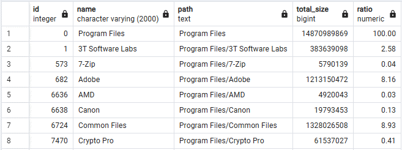

```sql
-- 1
WITH RECURSIVE t1 AS (
    SELECT id, parent_id, name, type, name::TEXT AS path
    FROM file_system
    WHERE parent_id IS NULL
    UNION ALL
    SELECT fs.id, fs.parent_id, fs.name, fs.type, t1.path||'/'||fs.name
    FROM file_system fs
    JOIN t1 ON fs.parent_id = t1.id
)
SELECT id, name, path
FROM t1
WHERE type = 'DIR';

-- 2
WITH RECURSIVE t1 AS (
    SELECT id, parent_id, name, type, name::TEXT AS path, file_size AS total_size
    FROM file_system
    WHERE parent_id IS NULL
    UNION ALL
    SELECT fs.id, fs.parent_id, fs.name, fs.type, t1.path||'/'||fs.name, t1.total_size + fs.file_size
    FROM file_system fs
    JOIN t1 ON fs.parent_id = t1.id
)
SELECT id, name, path, total_size
FROM t1
WHERE type = 'DIR';

-- 3
WITH RECURSIVE t1 AS (
    SELECT id, parent_id, name, type, name::TEXT AS path, file_size AS total_size
    FROM file_system
    WHERE parent_id IS NULL
    UNION ALL
    SELECT fs.id, fs.parent_id, fs.name, fs.type, t1.path||'/'||fs.name, t1.total_size + fs.file_size
    FROM file_system fs
    JOIN t1 ON fs.parent_id = t1.id
), t2 AS (
	SELECT parent_id, SUM(total_size) AS total_size
    FROM t1
    GROUP BY parent_id
)
SELECT t1.id, t1.name, t1.path, t1.total_size,
	ROUND(t1.total_size::NUMERIC * 100 / COALESCE(t2.total_size, t1.total_size), 4) AS ratio
FROM t1
LEFT JOIN t2 ON t1.parent_id = t2.parent_id;
```
